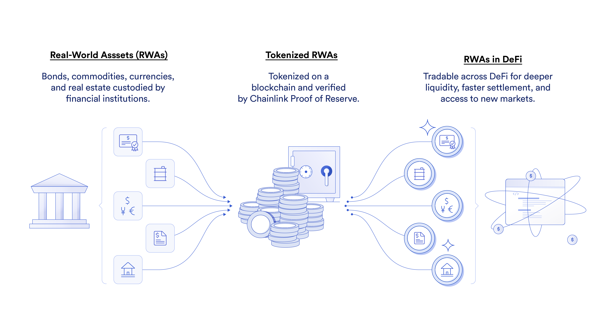

# Real-World Asset (RWA) Tokenization — Developer Handbook & Reference Implementation

Open-source resource hub by [QuillAudits](https://www.quillaudits.com) for developers, auditors, and researchers building **tokenized real-world assets (RWAs)** on blockchain. It includes a working Foundry reference implementation (a synthetic tokenized Apple share backed by WETH with Chainlink oracles), an RWA categorization framework, token standard references, and the audit methodology we apply to RWA protocols.

**Quick links:**
[📘 RWA Development Handbook](https://www.quillaudits.com/research/rwa-development) ·
[🧭 Tokenization 101 (interactive standard picker)](https://www.quillaudits.com/tokenization-101) ·
[💥 RWA Incident Database](https://www.quillaudits.com/tokenization-101/incidents) ·
[⚖️ Build vs Buy: Platform Comparison](https://www.quillaudits.com/tokenization-101/build-vs-buy) ·
[🛡️ Get an RWA Security Audit](https://www.quillaudits.com/services/rwa-security-audit)

---

## Contents

- [RWA Development Handbook](#rwa-development-handbook)
- [Understanding Real-World Assets on Blockchain](#understanding-real-world-assets-on-blockchain)
- [Types of RWAs](#types-of-rwas)
- [Key Components and Considerations](#key-components-and-considerations-in-rwas)
- [Categorisation of RWAs](#categorisation-of-rwas)
- [RWA Token Standards](#rwa-token-standards)
- [Reference Implementation: Tokenising an Apple Share](#tokenising-an-apple-share)
- [Auditing Process for RWA Tokenization](#auditing-process-for-tokenization-of-real-world-assets)
- [Fuzz Testing in RWA Audits](#integration-of-fuzz-testing-in-the-audit-process)
- [Further Reading](#further-reading)
- [Related QuillAudits Repositories](#related-quillaudits-repositories)

---

## RWA Development Handbook

> **Start here if you want to truly understand how RWA systems are designed, built, and regulated.**

<p align="center">
  <a href="https://www.quillaudits.com/research/rwa-development">
    
  </a>
</p>

We've published a full-length handbook at **[quillaudits.com/research/rwa-development](https://www.quillaudits.com/research/rwa-development)**.

It is written for builders, auditors, founders, and protocol architects who need a complete mental model of RWA systems — from off-chain custody and legal structures to on-chain token standards, settlement flows, and compliance enforcement. Key chapters:

- [Ecosystem Landscape](https://www.quillaudits.com/research/rwa-development/rwa-handbook/understanding-rwa-ecosystem) — how Ondo, Centrifuge, Maple, Securitize, Backed, OpenEden, Superstate and 15+ platforms are actually architected (vaults, SPVs, tranching, compliance layers)
- [Regulations Mapping](https://www.quillaudits.com/research/rwa-development/rwa-handbook/understanding-rwa-regulations) — jurisdiction-by-jurisdiction rules for tokenized assets
- [RWA System Design](https://www.quillaudits.com/research/rwa-development/developer/rwa-system-design) — end-to-end architecture for developers
- [First RWA: Stablecoins](https://www.quillaudits.com/research/rwa-development/developer/first-rwa-stablecoins) and [Chains Built for RWAs](https://www.quillaudits.com/research/rwa-development/developer/chains-built-for-rwa)

Prefer to explore interactively? **[Tokenization 101](https://www.quillaudits.com/tokenization-101)** lets you pick an asset class and chain and get the right token standard with live market data.

## Understanding Real World Assets on Blockchain

Tokenized real-world assets (RWAs) are blockchain-based digital tokens that represent physical and traditional financial assets, such as cash, commodities, equities, bonds, credit, artwork, and intellectual property. The tokenization of RWAs marks a significant shift in how these assets can be accessed, exchanged, and managed, unlocking an era of new opportunities for both blockchain-powered financial services and a wide variety of non-financial use cases underpinned by cryptography and decentralized consensus. RWAs can be tokenized on blockchain networks, allowing for fractional ownership, increased liquidity, and enhanced accessibility to traditionally illiquid assets.

## Types of RWAs

Real World Assets (RWAs) encompass a wide range of tangible and intangible assets with intrinsic value. These are just a few examples of the diverse range of assets that can be tokenized on the blockchain.

1. **Real Estate**: Residential, commercial, and industrial properties. Real estate tokenization allows investors to own fractional shares of properties, providing liquidity and diversification. See our [technical guide to real estate tokenization](https://www.quillaudits.com/blog/rwa/technical-guide-to-real-estate-tokenization).

2. **Commodities**: Physical commodities such as precious metals (gold, silver), agricultural products (grains, coffee), energy resources (oil, natural gas), and others can be tokenized to facilitate trading and investment.

3. **Art and Collectibles**: Tokenization of art, rare collectibles, and memorabilia enables fractional ownership and investment opportunities in traditionally illiquid markets.

4. **Intellectual Property (IP)**: Patents, copyrights, trademarks, and other IP rights. Tokenization allows creators to monetize their IP assets and investors to participate in revenue-sharing agreements.

5. **Equity and Securities**: Shares of private companies, stocks, bonds, and other financial instruments can be tokenized to increase liquidity, streamline transactions, and enable global access to capital markets.

6. **Revenue-Generating Contracts**: Contracts with predictable revenue streams, such as leases, royalties, and licensing agreements.

7. **Deeds and Titles**: Tokenization of deeds, titles, and ownership certificates for real estate, vehicles, and other assets can streamline transfer processes and enhance transparency in ownership records.

8. **Carbon Credits and Renewable Energy Assets**: Environmental assets such as carbon credits, renewable energy certificates (RECs), and carbon offsets.

9. **Luxury Assets**: High-value items such as yachts, private jets, and luxury watches.

## Key Components and Considerations in RWAs



Developing a Real World Asset (RWA) on the blockchain involves several steps and considerations to ensure compliance, security, and efficiency.

1. **Define the Asset**: Determine the real-world asset you want to tokenize on the blockchain — real estate, commodities, art, intellectual property, or any other asset with tangible or intrinsic value.

2. **Legal and Regulatory Compliance**: Understand the legal and regulatory requirements for tokenizing the chosen asset. Depending on the jurisdiction and asset type, you may need to comply with securities regulations, property laws, AML regulations, and KYC requirements. Our handbook's [Regulations Mapping chapter](https://www.quillaudits.com/research/rwa-development/rwa-handbook/understanding-rwa-regulations) covers the major jurisdictions.

3. **Choose the Blockchain Platform**: Select a suitable blockchain platform for tokenizing the asset. Ethereum and other smart contract platforms are commonly used due to their programmability and established ecosystem; several chains are now [purpose-built for RWAs](https://www.quillaudits.com/research/rwa-development/developer/chains-built-for-rwa).

4. **Token Standards**: Choose a token standard that suits the characteristics of the asset — see the [RWA Token Standards](#rwa-token-standards) section below for the full landscape (ERC-20, ERC-721, ERC-1400, ERC-3643, ERC-4626, and non-EVM standards).

5. **Collateralization**: Many tokenized RWAs are backed by collateral — the asset itself (direct backing) or other assets and financial instruments (indirect backing). The collateralization process ensures that the on-chain token maintains a stable and defined value relative to the off-chain asset it represents.

6. **Smart Contract Development**: Develop smart contracts to represent and manage the asset on the blockchain — token issuance, transfer rules, ownership rights, and lifecycle management.

7. **Oracles and Data Feeds**: Integrate oracles to bridge the gap between the blockchain and the real world — asset valuations, ownership records, or regulatory compliance information. Oracle and NAV manipulation is among the most common RWA attack vectors; see [real incidents](https://www.quillaudits.com/tokenization-101/incidents).

8. **Tokenization Process**: Mint digital tokens on the blockchain, each representing ownership or fractional ownership of the underlying asset, following legal requirements with proper documentation.

9. **Security and Audits** (we're here for it :D): Conduct [security audits](https://www.quillaudits.com/services/rwa-security-audit) of smart contracts and overall system architecture to identify and mitigate vulnerabilities. Implement secure development best practices and deploy on testnets for thorough testing.

## Categorisation of RWAs


We can tokenize real-world assets by combining any of the following traits:

1. **Asset location**: On-chain or Off-chain
2. **Collateral location**: On-chain or Off-chain collateral
3. **Backing type**: Direct backing or Indirect (synthetic)

- **Asset location** — the location of the asset being tokenised.
  - Example: Real estate & gold are off-chain assets whereas BTC & ETH are on-chain assets.
- **Collateral location** — the location of the collateral.
  - Example: PAXG is a digital token backed by physical gold (off-chain collateral) & the DAI stablecoin requires on-chain collateral.
- **Backing type** — the type of collateral backing the asset.
  1. Direct backing — collateral backing the asset is the same as the asset. Example: PAXG is directly backed by gold; USDC is directly backed by USD.
  2. Synthetic (indirect) backing — collateral backing the asset is not the same as the asset. Example: DAI by MakerDAO is backed by on-chain collateral consisting of other crypto tokens.

Since we have 3 categories each with 2 options, there are 8 possible types of RWAs — though not all of them have been implemented in practice. We focus on the five majorly used categories:

1. On-Chain Asset with On-Chain Collateral and Direct Backing
2. On-Chain Asset with On-Chain Collateral and Synthetic (Indirect) Backing
3. Off-Chain Asset with Off-Chain Collateral and Direct Backing
4. Off-Chain Asset with Off-Chain Collateral and Indirect Backing
5. Off-Chain Asset with On-Chain Collateral and Indirect Backing

## On-Chain Asset with On-Chain Collateral and Direct/Indirect Backing

Wrapped ETH (WETH) and Wrapped BTC (WBTC) are examples of on-chain assets which are directly/indirectly backed by on-chain collateral.

- **WETH**: Ether (ETH), the native cryptocurrency of Ethereum, doesn't conform to the ERC-20 token standard. WETH allows ETH to be "wrapped" into an ERC-20 compatible format: users send ETH to the WETH smart contract, which locks the ETH and issues an equivalent amount of WETH. The process is reversible, and WETH is directly backed by ETH at a 1:1 ratio held in the contract.

- **WBTC**: WBTC brings Bitcoin's liquidity to the Ethereum ecosystem. BTC is sent to a custodian, who mints an equivalent amount of WBTC on Ethereum; holders can redeem WBTC for BTC. Each WBTC represents one BTC held by custodians off-chain, managed through on-chain minting and burning mechanisms.

## Off-Chain Asset with Off-Chain Collateral and Direct/Indirect Backing

USDT and USDC fall into a unique category of RWAs — digital tokens representing fiat currencies on blockchain platforms, characterized by off-chain assets (fiat, gold, stock shares, real estate) and off-chain collateral.

- **Technical framework for tokenizing RWAs:**
  - **Smart Contracts**: Self-executing contracts governing the creation, distribution, and management of tokens representing RWAs.
  - **Asset Custody and Verification**: Ensuring the real-world asset is securely held and verified — a secure vault for gold, a reliable registry for real estate.
  - **Oracles for Real-World Data**: Bringing real-world information (valuations, ownership changes, price fluctuations) on-chain securely.
  - **Regulatory Compliance and Legal Framework**: Legal structures that recognize token ownership as equivalent to owning a portion of the physical asset.
  - **Token Standards and Interoperability**: Established standards ensure tokens interact seamlessly with wallets, exchanges, and other smart contracts.

- **Examples:**
  - **Gold**: Digital tokens backed by physical gold in secure vaults, e.g. [Paxos Gold (PAXG)](https://github.com/paxosglobal/paxos-gold-contract/tree/master/contracts).
  - **Real Estate**: Fractional ownership via tokens representing shares in a property or rights to rental income — see [currently active real estate RWA projects](https://www.alchemy.com/best/real-estate-rwas) and our [real estate tokenization guide](https://www.quillaudits.com/blog/rwa/technical-guide-to-real-estate-tokenization).
  - **Stock Market Shares**: Digital tokens representing ownership of a company's stock, enabling fractional ownership and global access — exactly what the [reference implementation below](#tokenising-an-apple-share) demonstrates.

## Off-Chain Asset with On-Chain Collateral and Indirect Backing

The DAI stablecoin is a notable example: its value is pegged to the U.S. dollar (an off-chain asset), while its collateral consists of cryptocurrencies stored on-chain within the MakerDAO system. This is indirect backing — DAI is stabilized against the dollar through smart contracts and collateralized debt positions, not a 1:1 dollar reserve.

## RWA Token Standards

Choosing the right standard is the single highest-leverage design decision in an RWA system. The full landscape, with specs, function-level breakdowns, and security considerations, is in the [handbook](https://www.quillaudits.com/research/rwa-development) — or use [Tokenization 101](https://www.quillaudits.com/tokenization-101) to get a recommendation for your asset class and chain.

| Standard | Purpose | Reference |
|---|---|---|
| **ERC-3643 (T-REX)** | Permissioned tokens for regulated securities — onchain identity + modular compliance | [Handbook page](https://www.quillaudits.com/research/rwa-development/relevant-standards/erc-3643-token) · [Explainer](https://www.quillaudits.com/blog/rwa/erc-3643-explained) |
| **ERC-4626** | Tokenized yield-bearing vaults (treasuries, private credit) | [Handbook](https://www.quillaudits.com/research/rwa-development/relevant-standards/erc-4626-standard) |
| **ERC-7540** | Asynchronous ERC-4626 vaults (request-based deposit/redeem) | [Handbook](https://www.quillaudits.com/research/rwa-development/relevant-standards/erc-7540-async-erc-4626-tokenized) |
| **ERC-1400** | Partitioned security tokens with document management | [Handbook](https://www.quillaudits.com/research/rwa-development/relevant-standards/erc-1400-token-standard) |
| **ERC-7518** | Dynamic compliant interoperable security token | [Explainer](https://www.quillaudits.com/blog/rwa/understanding-erc-7518) |
| **ERC-7943** | Universal RWA interface | [Explainer](https://www.quillaudits.com/blog/rwa/erc-7943-explained) |
| **Non-EVM** | Solana Token-2022 & sRFC-20, Algorand ASA, Stellar, Tezos FA2/CMTAT, Hedera HTS, Cardano, Aptos, Sui, Kadena, Polkadot Asset Hub | [Non-EVM standards](https://www.quillaudits.com/research/rwa-development/non-evm-standards/solana-srfc-00020) |

## Tokenising an Apple Share

In this repository, we dive deep into the technicalities of RWA tokenisation by developing an **Apple Coin (AAPL) ERC-20 token** where the value of each AAPL token is 1:1 pegged to the real-time value of an Apple share in the US stock market. The backing collateral is WETH (on-chain collateral, indirectly backed), with prices from Chainlink feeds.


### Run it yourself

```bash
git clone https://github.com/Quillhash/Real-World-Assets-RWA.git
cd Real-World-Assets-RWA
forge build
forge test
```

Built with [Foundry](https://book.getfoundry.sh/); dependencies: OpenZeppelin, Chainlink contracts, forge-std.

The AAPL smart contract is designed to tokenize Apple shares, allowing users to mint and redeem tokens that represent a share in Apple, using ETH as collateral. The system remains over-collateralized, maintaining algorithmic stability without governance or fees.

**Constructor**


-   The constructor sets up the contract by initializing it with the addresses of the Chainlink price feeds for Apple shares (AAPL) and ETH/USD. These feeds are essential for determining the value of the collateral and the AAPL tokens in USD.
-   Inherits from OpenZeppelin's ERC20 to provide standard token functionalities.

**External Functions**

1. `depositAndmint`:


-   Allows users to deposit ETH as collateral and mint AAPL tokens in the same transaction.
-   The amount of ETH sent with the transaction is added to the user's collateral balance.
-   The amountToMint of AAPL tokens is added to the user's minted balance.
-   Checks if the resulting health factor meets the minimum requirement, reverting the transaction if it doesn't, to ensure the system remains over-collateralized.
-   Mints the AAPL tokens to the user's account using the \_mint function from the ERC20 standard.

2. `redeemAndBurn`:


-   Users can redeem AAPL tokens and receive the equivalent value in ETH collateral.
-   The USD value of the AAPL tokens to redeem is calculated, and the equivalent amount of ETH is determined.
-   The AAPL tokens are subtracted from the user's minted balance, and the health factor is checked to ensure system stability.
-   The AAPL tokens are burned, and the equivalent ETH is sent back to the user.
-   Reverts if the ETH transfer fails, ensuring atomicity.

**Public/View Functions**

1. `getHealthFactor`


-   Computes and returns the health factor of a user's account, which indicates the level of over-collateralization.

2. `getUsdAmountFromaapl`


-   `amountaaplInWei`: The amount of AAPL tokens for which the USD value is being requested. It's denoted in Wei to maintain precision, considering that Ethereum and many tokens on the Ethereum blockchain, including ERC-20 tokens like AAPL, can have up to 18 decimal places.
-   The function returns the USD value of the specified amount of AAPL tokens as a uint256. This value is calculated based on the current price of an Apple share, as provided by an oracle.
-   The function first initializes a priceFeed object using the AggregatorV3Interface interface and the address of the AAPL price feed oracle (`i_aaplFeed`), which provides the current market price of an Apple share.
-   It then calls `staleCheckLatestRoundData()` on the priceFeed object, which is a method from the Chainlink Aggregator interface designed to fetch the latest reliable price data. The function returns multiple values, but only the price is used here, which represents the current price of an Apple share in USD.
-   The function calculates the USD value by multiplying the `amountaaplInWei` (the amount of AAPL tokens for which the value is being calculated) by the price of an Apple share in USD (uint256(price)).
-   To maintain precision, the price is first multiplied by `ADDITIONAL_FEED_PRECISION` (a constant that adjusts for the difference in decimal places between the token and the USD value as provided by the oracle).
-   The result is then divided by `PRECISION`, another constant used to adjust the final value back to a standard decimal format, ensuring the result is accurate and usable.

3. `getUsdAmountFromEth` & `getEthAmountFromUsd`


-   `getUsdAmountFromEth`: Returns the USD value of a given amount of ETH using the ETH/USD price feed.
-   `getEthAmountFromUsd`: Converts a USD amount to the equivalent ETH amount, facilitating the redemption process.
-   Both the functions are similar to `getUsdAmountFromaapl` and are executed in a similar way

4. `getAccountInformationValue`


-   Aggregates and returns the total USD values of AAPL minted and ETH collateral for a specific user, useful for understanding a user's position and the health factor calculation.

**Private/View Functions**

1. `_calculateHealthFactor`


-   `aaplMintedValueUsd`: The USD value of the AAPL tokens minted by the user.
-   `collateralValueUsd`: The USD value of the ETH collateral deposited by the user.
-   If the user has not minted any AAPL tokens (aaplMintedValueUsd == 0), the function returns the maximum possible uint256 value, indicating infinite health (no debt).
-   The function calculates the adjusted collateral value based on the LIQUIDATION_THRESHOLD, ensuring the user maintains a collateralization ratio above this threshold.
-   The health factor is computed as the ratio of the adjusted collateral value to the value of minted AAPL tokens, scaled by PRECISION to maintain decimal accuracy.

2. `_getAccountInformation`


-   `totalaaplMinted`: The total amount of AAPL tokens minted by the user.
-   `totalCollateralEth`: The total amount of ETH collateral deposited by the user.
-   The function accesses two mappings: s_aaplMintedPerUser and s_ethCollateralPerUser, using the user's address as the key.
-   It retrieves and returns the total amounts of AAPL tokens minted and ETH collateral deposited by the specified user.

## Auditing Process for Tokenization of Real-World Assets

Tokenizing real-world assets on the blockchain involves creating digital representations of physical or non-physical assets (such as stocks, bonds, commodities, or real estate) through tokens. This process requires rigorous security, legal compliance, and accurate representation of asset values through reliable data feeds. The use of oracles and off-chain data sources is central to ensuring that the token values reflect the real-world prices and attributes of the assets they represent.

1. Security Audit:

-   Code Review: Thorough examination of the smart contract code for security vulnerabilities such as reentrancy attacks, overflow/underflow errors, and improper access controls.
-   Architecture Review: Ensuring that the contract structure and data flows are secure against potential threats and that the system architecture supports robust handling of edge cases.

2. Oracle Reliability and Data Integrity:

-   Oracle Choice and Implementation: Evaluation of the oracles and data sources used for accuracy and resistance to manipulation.
-   Fallback Mechanisms: Assessment of mechanisms in place for handling oracle failures or discrepancies in data feeds.

3. Compliance and Legal Review:

-   Regulatory Compliance: Ensuring the tokenization process adheres to local and international regulations concerning asset tokenization and digital securities.
-   Tokenomics and Rights Attached: Verification that the tokens accurately represent the underlying assets in terms of ownership, dividends, voting rights, etc.

4. Functional Testing:

-   Unit Testing: Detailed tests for each function to ensure they perform as expected under various conditions.
-   Integration Testing: Testing the contract’s interactions with external contracts and services like oracles.
-   Scenario Testing: Simulating different operational scenarios to test how the contract behaves under unusual or extreme conditions.

5. Performance and Gas Efficiency:

-   Optimization Review: Ensuring that the contract operations are optimized for gas efficiency, which is crucial for scalability and user costs.
-   Load Testing: Assessing the contract’s performance under high transaction volumes.

6. User Role and Access Control:

-   Permissions and Roles: Ensuring that functions are accessible only to authorized users and that roles are clearly defined and enforced within the contract.

#### Specific Audit of the Provided Smart Contract

Now, let’s apply this auditing framework to the provided AAPL smart contract:

1. Security Audit

-   Reentrancy: The functions `depositAndmint` and `redeemAndBurn` are susceptible to reentrancy attacks, especially since they involve transferring ETH. This should be mitigated by using the checks-effects-interactions pattern.

2. Compliance and Legal Review

-   Token Representation: The contract mints tokens representing shares of Apple, which are securities. This requires compliance with securities regulations, including but not limited to the SEC in the U.S. or equivalent bodies elsewhere.
-   Rights and Obligations: There is no code managing dividends or other rights typically associated with stock ownership. This aspect might need to be integrated or clearly defined off-chain.

3. Functional Testing

-   Unit and Integration Testing: Ensure comprehensive coverage, including scenarios where the oracle feeds provide unexpected values.
-   Edge Case Handling: More tests are needed around the limits of minting and redemption, especially under fluctuating oracle values.

4. Performance and Gas Efficiency

-   Gas Cost Analysis: Functions like `depositAndmint` and `redeemAndBurn` involve multiple state changes and external calls, which can be gas-intensive. Optimization might be required.

5. User Role and Access Control

-   Access Controls: The contract currently does not implement any special access controls beyond the typical ownership patterns. Depending on the business model, you might need role-based access control mechanisms.

> For real-world examples of what goes wrong when these steps are skipped, see our curated **[RWA incident database](https://www.quillaudits.com/tokenization-101/incidents)** — $106M+ in tokenization failures mapped by asset class, failure mode, and token standard.

## Integration of Fuzz Testing in the Audit Process

Purpose: Fuzz testing is critical for identifying hidden issues that are not obvious during regular testing phases. It helps in detecting vulnerabilities like buffer overflows, crashes, memory leaks, and handling of unexpected or malicious inputs.

Process: Fuzz testing involves providing random data (inputs) to the smart contract functions to observe their behavior and track how well the contract handles edge or error cases.

Tools: In the Ethereum ecosystem, tools like Echidna and Foundry (with its forge fuzz command) are popular for conducting fuzz tests on smart contracts.

### Application to the AAPL Smart Contract

For the `AAPL` smart contract, incorporating fuzz testing would mean:

1. Target Functions: Functions like depositAndmint and redeemAndBurn, which are crucial and involve significant state changes and financial calculations, are ideal candidates for fuzz testing.
2. Scenario Creation: Generate inputs to cover a range of possible values for amounts to mint and redeem, ensuring the testing covers edge cases like zero inputs, extremely high values, and values that are borderline acceptable for minting and redemption based on the current oracle price feeds.
3. Oracle Mocking: To effectively fuzz test depositAndmint and redeemAndBurn, you would also need to simulate various responses from the oracle (e.g., high, low, rapidly changing, and static prices) to see how the contract handles these scenarios.

#### Why Include Fuzz Testing in the Audit

1. Coverage: Fuzz testing expands the test coverage by exploring paths that are not typically considered during standard testing, increasing the confidence in the contract’s reliability and security.

2. Automation: Fuzz tests can be automated and run continuously as regression tests, helping catch issues that might be introduced as the contract evolves.

3. Complexity Handling: Contracts interacting with external data sources like oracles can behave unpredictably. Fuzz testing helps ensure that the contract can handle such complexity and variability without failing.

---

## Further Reading

- [RWA Security Risks and Best Practices](https://www.quillaudits.com/blog/rwa/rwa-security-risks-and-practices) — securing tokenized assets end-to-end
- [Top 10 RWA Attack Vectors](https://www.quillaudits.com/blog/rwa/top-10-rwa-attack-vectors) — every developer & auditor must watch
- [Cross-Chain RWA Architecture](https://www.quillaudits.com/blog/rwa/cross-chain-rwa-architecture)
- [RWA Settlement & Redemption](https://www.quillaudits.com/blog/rwa/rwa-settlement-and-redemption)
- [Build vs Buy: 17+ Tokenization Platforms Compared](https://www.quillaudits.com/tokenization-101/build-vs-buy)
- [Web3 Hacks Database](https://www.quillaudits.com/web3-hacks-database)

## Related QuillAudits Repositories

- [Solidity-Attack-Vectors](https://github.com/Quillhash/Solidity-Attack-Vectors) — catalogue of Solidity vulnerabilities
- [DeFi-Attack-Vectors](https://github.com/Quillhash/DeFi-Attack-Vectors) — DeFi-specific threat patterns
- [QuillAudit Audit Reports](https://github.com/Quillhash/QuillAudit_smart_contract_audit_Reports) — public audit reports incl. RWA & DeFi protocols
- [Web3 Security Tools](https://github.com/Quillhash/Web3-Security-Tools) — curated tooling directory
- [Auditor Roadmap](https://github.com/Quillhash/QuillAudit_Smart_contract_Auditor_Roadmap) — learn smart contract auditing

## About QuillAudits

[QuillAudits](https://www.quillaudits.com) is a Web3 security firm with 1,500+ projects secured and $3B+ in digital assets under protection. If you're building an RWA protocol, [talk to us about an audit](https://www.quillaudits.com/services/rwa-security-audit) or check your design's [RWA security score](https://www.quillaudits.com/rwa-security-score).

## License

MIT — see [LICENSE](./LICENSE).